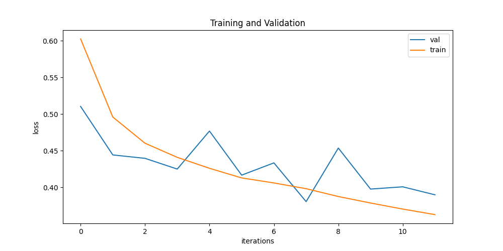

<p align="left">
  <a href="https://easybase.io">
    
  </a>
</p>

<br />
<br />

<p align="center">
  <a href="https://easybase.io">
    
  </a>
</p>

<br />


<h3 align="center">
  <b>
    <a href="https://dark-pufferfish-259.notion.site/DataA-b16ec247c20443b192059ade27cfbdcf">
      Cloud Coverage Detection 🚀
    </a>
  </b>
</h3>

<br />

<!-- DOCUMENTATION -->
## 📓 Problem
Develop a Model for the task of binary cloud segmentation. The model should have size less than 250MB.
The the trained model should be converted in onnx and used in inference with onnxruntime.

## 💡 Solution
I will firstly tile the images (and their mask) in order to obtain 224x224 images. Note thaht only the cloud channel is needed from the 3 mask channels.
Then I can use a pretrained network to solve the task. The problem with this is that these pretrained UNET bases network are pretty large, so pruning/quantization method is needed in this case. 
So instead I will develop a small UNET based network from scratch. The small model is based on the paper [Convolutional Neural Networks enable efficient, accurate and fine-grained segmentation of plant species and communities from high-resolution UAV imagery](https://www.nature.com/articles/s41598-019-53797-9)  

<center></center>
In our case the model should excpect 4 input channels and output a single binary mask. The model should be small enouh to fit the requirements.
Then I will convert it to onnx and run with onnxruntime. 
This Readme will help you to replicate all my work step by step.
<br/>

The model was validated using kfold-cross-validation for a more robust validation.
The model loss and accuracy was monitored during training.
Hyperparameters:
  - optimizer : Adam
  - learning rate : 0.01
  - batch_size : 128

<div class="row">
  <div class="column">
    
  </div>
  <div class="column">
    
  </div>
</div>

## 💡 Some Future Work
- See how different augmentation can help
- Try different models
- Monitor other metrics (i.e IoU)
- Use some monitoring tool (W&B)
- Set config file for hyperparameters (usually YAML)
- Search optimal hyperparameters

<!-- CLONE -->
## 💻 Clone Repo

Clone this repository with the following git command.
```
git clone https://github.com/March-08/sentinel_cloud_coverage.git
```

<!-- CREATE ENV -->
## 🌳 Create Env

Create a new Python virtual environment. More about virtual env with conda [here](https://conda.io/projects/conda/en/latest/user-guide/tasks/manage-environments.html)
```
conda create --name venv python
conda activate venv
```

<!-- INSTALL REQUIREMENTS -->
## ✒️ Install Requirements

Install needed packages from requirements.txt 
```
pip install -r requirements.txt
```


<!-- RUN -->
## 🏃‍♂️ Run

### Add Data
Now download end extract data from [zenodo](https://zenodo.org/record/4172871#.Y-KHonbMI2w). Create additional the directories images_patches and masks_patches. You should now have a data structure like the following:
```
├── data/
│   ├── images_patches
│   ├── masks
│   ├── masks_patches
│   ├── subscenes
│   ├── masks.zip
│   └── subscenes.zip
``` 

### Extract Data
The first step is to extract tiles from the subscenes. You can extract 224^2 images simply by running the following command.
```
python src/main.py extract
```
This will populate your patches directories.


### Train
In order to launch your training you can run the following command. FYI The hyper-parameters are hard coded  in this example task. 
```
python src/main.py train 
```


### ONNX Conversion
Now its time conver the PyTorch model to ONNX. I used the [torch.onnx module](https://pytorch.org/docs/stable/onnx.html). To run the conversion you can use the following command:
```
python src/main.py onnx
```
This script will firsly check the consistency of the pth model and the onnx model. Then you will find in your main directory the model.onnx which will be ready to be used in inference with onnxruntime.


# Inference on Google Colab
 

In this repository you will find an example of inference of the onnx model in a jupyter notebook. The same code can be used in Google Colab.

Otherwise import the 'unet.onnx' model of this repository in your Google Colab workplace.
Then let's import the needed libraries.

```python
import numpy as np
import torch
from torch import nn
import matplotlib.pyplot as plt
import math
import onnx
import onnxruntime
```

Now import and load the model with the following commands.

```python
onnx_model = 'path_to_onnx_model.onnx'
onnx_model = onnx.load(onnx_model)
onnx.checker.check_model(onnx_model)
ort_session = onnxruntime.InferenceSession(onnx_model.SerializeToString())
```

Now load and preprocess and image for inference. The expected shape of the model is (1,4,224,224). So we need to preprocess the original image of shape (224,224,4) 

```python
def to_numpy(tensor):
        return tensor.detach().cpu().numpy() if tensor.requires_grad else tensor.cpu().numpy()
def preprocess(img):
        '''
        input img shape :(224, 224, 4)
        output normalized img shape: (4, 224, 224)
        '''
        print(img.shape)
        img = torch.from_numpy(img).cpu().permute(2,0,1).unsqueeze(0)
        img = (img - img.mean())/img.std()
        return img.numpy()

def sigmoid(x):
  return 1 / (1 + math.exp(-x))
sigmoid_v = np.vectorize(sigmoid)     

def post_process(ort_outs):
        return sigmoid_v(ort_outs[0][0,0,:,:]) > 0.5

image_path = '../data/images_patches/img_18_patch_16.npy'
mask_path = '../data/masks_patches/mask_18_patch_16.npy'

img = np.load(image_path)
mask = np.load(mask_path)
```

Now run the model

```python
# compute ONNX Runtime output prediction
ort_inputs = {ort_session.get_inputs()[0].name: preprocess(img)}
ort_outs = ort_session.run(None, ort_inputs)
```

If you want you can also plot the generated mask against the original one.

```python
plt.subplot(1,3,1)
plt.imshow(img[:,:,[0,1,2]]) # for visualization we have to transpose back to HWC
plt.subplot(1,3,2)
plt.imshow(mask) # for visualization we have to remove 3rd dimension of mask
plt.subplot(1,3,3)
plt.imshow(post_process(ort_outs)) 
plt.show()
```


